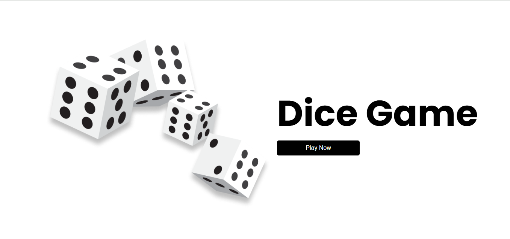
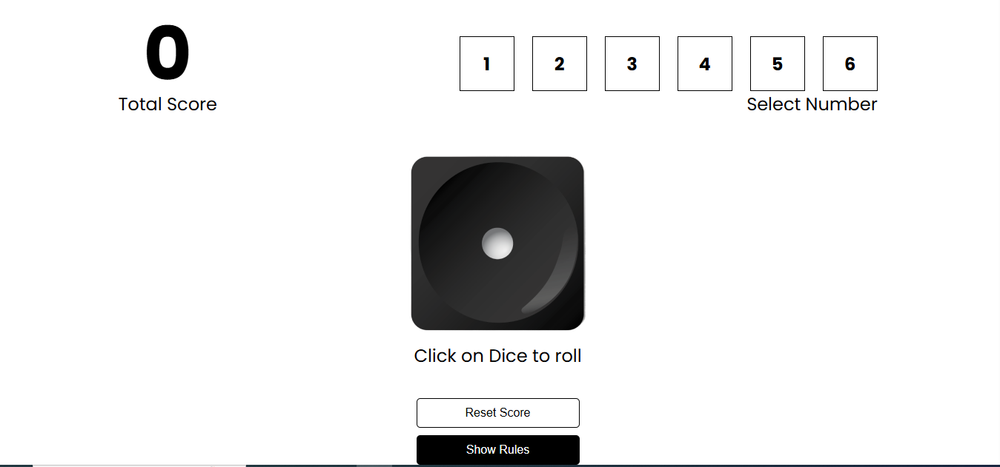
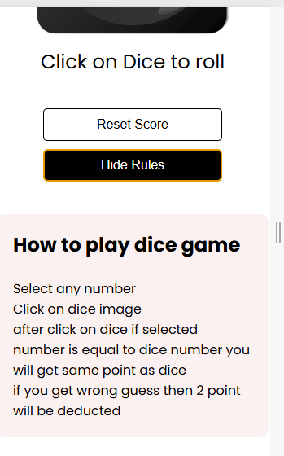

🎲 Dice Game (React + Tailwind CSS)

🚀 Live Demo

🔗 Play Dice Game

📌 Project Overview:

This is a simple and interactive Dice Game built using React.js and Tailwind CSS.
The game allows users to roll a dice and generate random numbers, making it fun and engaging.

🛠️ Tech Stack
⚛️ React.js
🎨 Tailwind CSS
📜 JavaScript (ES6+)
🌐 HTML5

🎮 Features
🎲 Random dice roll generation
⚡ Fast and responsive UI
🎨 Clean and modern design using Tailwind
🔄 State management using React hooks
📱 Fully responsive (mobile + desktop)

⚙️ Installation & Setup

Follow these steps to run the project locally:

# Clone the repository
git clone https://github.com/twniazi/Dice-game.git

# Navigate into the project folder
cd Dice-game

# Install dependencies
npm install

# Run the development server
npm run dev

📸 Screenshots
### 🏠 Home Page

### 📚 Play

### 📱 Rules

🤝 Contributing

Contributions are welcome!
If you want to improve this project, feel free to fork the repo and submit a pull request.

📧 Contact

If you have any questions or suggestions, feel free to reach out.

⭐ Support

If you like this project, don't forget to ⭐ the repository!
